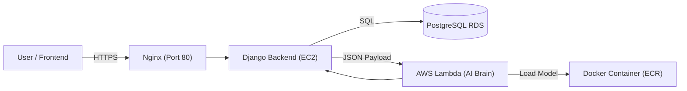

# 🏦 Intelligent Banking Support System (BankingAI)


> **A Cloud-Native, Serverless AI solution that classifies customer support tickets with 78% accuracy across 77 distinct banking intents.**

---

## 📖 Table of Contents
- [Architecture](#-architecture)
- [Features](#-features)
- [Tech Stack](#-tech-stack)
- [Installation & Local Setup](#-installation--local-setup)
- [AWS Deployment Architecture](#-aws-deployment-architecture)
- [API Documentation](#-api-documentation)

---

## 🏗 Architecture

This project implements a **Microservices Architecture** to decouple the web application from the heavy AI inference logic, ensuring scalability and cost-efficiency.




### **Workflow**

1.  **Frontend:** User submits a query (e.g., *"I lost my card"*).
2.  **API Gateway:** Nginx on AWS EC2 receives the request and forwards it to Gunicorn/Django.
3.  **Backend Logic:** Django processes the request and authenticates the user via **PostgreSQL (RDS)**.
4.  **AI Inference:** Django invokes a **Serverless AWS Lambda** function using `boto3`.
5.  **Prediction:** The Lambda function (running a Dockerized BERT model) classifies the intent and returns the confidence score.

-----

## 🚀 Features

  * **🧠 Advanced NLP Model:** Fine-tuned **BERT** Transformer on the **Banking77** dataset to detect 77 granular user intents.
  * **☁️ Serverless Inference:** Heavy AI computations are offloaded to **AWS Lambda**, reducing EC2 RAM usage and enabling infinite scaling.
  * **🐳 Dockerized AI:** The model is packaged into a concise Docker container (\~1.5GB) optimized for CPU inference using `torch-cpu`.
  * **🔒 Enterprise Security:**
      * EC2 and RDS secured via **AWS Security Groups**.
      * Lambda access restricted via **IAM Roles** (`AWSLambdaRole`).
      * No hardcoded credentials; uses AWS SDK (`boto3`) roles.
  * **⚡ Production Ready:** Deployed with **Gunicorn** and **Nginx** reverse proxy on Ubuntu Server.

-----

## 🛠 Tech Stack

| Component | Technology Used |
| :--- | :--- |
| **AI Model** | PyTorch, Hugging Face Transformers, BERT-base-uncased |
| **Backend API** | Django REST Framework (DRF), Python 3.11 |
| **Database** | AWS RDS (PostgreSQL) |
| **Compute** | AWS EC2 (Ubuntu 24.04), AWS Lambda |
| **Containerization** | Docker, AWS ECR |
| **Web Server** | Nginx, Gunicorn |
| **Frontend** | React.js, TailwindCSS |

-----

## 💻 Installation & Local Setup

### Prerequisites

  * Python 3.11+
  * Docker Desktop
  * AWS CLI (Configured)

### 1\. Clone the Repository

```bash
git clone [https://github.com/YOUR_USERNAME/BankingAI.git](https://github.com/YOUR_USERNAME/BankingAI.git)
cd BankingAI
```

### 2\. Setup Backend Environment

```bash
python -m venv venv
# Windows
.\venv\Scripts\activate
# Mac/Linux
source venv/bin/activate

pip install -r requirements.txt
```

### 3\. Configure Environment Variables

Create a `.env` file in the root directory:

```ini
DEBUG=True
SECRET_KEY=your_secret_key
DB_NAME=banking
DB_USER=postgres
DB_PASSWORD=your_db_password
DB_HOST=localhost
AWS_REGION=eu-north-1
LAMBDA_FUNCTION_NAME=BankingBrain
```

### 4\. Run Migrations & Server

```bash
python manage.py migrate
python manage.py runserver
```

Visit `http://localhost:8000/api/predict/` to test.

-----

## ☁️ AWS Deployment Architecture

### **1. The "Brain" (AWS Lambda)**

  * The AI model is packaged as a Docker image.
  * **Optimization:** Used `torch --index-url .../cpu` to reduce image size from 6GB to 1.5GB.
  * **Configuration:** 3GB RAM, 1-minute timeout, `OMP_NUM_THREADS=1` to prevent deadlocks.

### **2. The "Body" (AWS EC2)**

  * **Instance:** t2.micro (Free Tier Eligible).
  * **OS:** Ubuntu 24.04 LTS.
  * **Server:** Nginx (Reverse Proxy) $\rightarrow$ Gunicorn (WSGI) $\rightarrow$ Django.

### **3. The "Memory" (AWS RDS)**

  * **Engine:** PostgreSQL 16.
  * **Security:** Inbound rules allow traffic ONLY from the EC2 security group.

-----

## 🔌 API Documentation

### **Endpoint:** `POST /api/predict/`

**Request Body:**

```json
{
  "text": "I lost my platinum credit card and need a new one sent to my house."
}
```

**Success Response (200 OK):**

```json
{
  "success": true,
  "input": "I lost my platinum credit card...",
  "prediction": {
    "category": "lost_or_stolen_card",
    "confidence": 0.9842,
    "category_id": 45
  }
}
```

-----

### 👤 Author

**Roushan Mondal**

  * [LinkedIn](https://github.com/roushanmondal)

<!-- end list -->